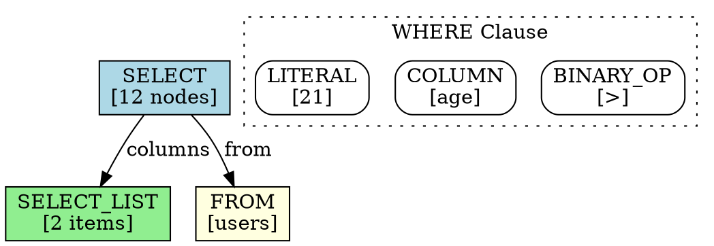

# DB25 Parser - AST Visualization Design

**Version:** 1.0  
**Date:** March 2025  
**Author:** Chiradip Mandal  
**Organization:** Space-RF.org

## Executive Summary

AST visualization is a first-class concern in the DB25 Parser design. This document specifies how the AST structure supports efficient traversal, export, and visualization while maintaining the performance characteristics of the core parser.

---

## Core Requirements

### Functional Requirements

1. **Multiple Export Formats** - JSON, DOT, S-expressions, custom binary
2. **Interactive Visualization** - Node selection, expansion, filtering
3. **Debugging Support** - Breakpoints, step-through, value inspection  
4. **Differential Views** - Compare ASTs, show optimizations
5. **Large AST Handling** - Stream processing, pagination, filtering
6. **Live Updates** - Incremental changes for IDE integration
7. **Query Plan Integration** - Link AST to execution plan

### Performance Requirements

1. **Zero-Copy Export** - No AST duplication for visualization
2. **Streaming Support** - Handle ASTs larger than memory
3. **Selective Export** - Export only relevant subtrees
4. **Lazy Evaluation** - Compute visualization data on demand
5. **Cache Friendly** - Maintain locality during traversal

---

## AST Node Enhanced Design

### Visualization-Ready Node Structure

```cpp
// Enhanced AST node with visualization support
struct alignas(64) ASTNode {
    // === First Cache Line (64 bytes) ===
    
    // Core Header (8 bytes)
    uint8_t  node_type;         // Node type enum
    uint8_t  flags;             // Various flags
    uint16_t child_count;       // Number of children
    uint32_t node_id;           // Unique node ID for visualization
    
    // Source Mapping (8 bytes)
    uint32_t source_start;      // Start position in query
    uint32_t source_end;        // End position in query
    
    // Tree Links (24 bytes)
    ASTNode* parent;            // Parent node
    ASTNode* first_child;       // First child
    ASTNode* next_sibling;      // Next sibling
    
    // Visualization Metadata (24 bytes)
    union {
        struct {
            uint16_t depth;           // Tree depth
            uint16_t subtree_size;    // Total nodes in subtree
            uint32_t hash;            // Subtree hash for comparison
            const char* label;        // Display label
            uint32_t color_hint;      // Visualization color hint
            uint32_t cost_estimate;   // For query plan viz
        } viz_meta;
        
        // Original payload for non-viz use
        struct {
            // ... node-specific data
        } payload;
    };
};
```

### Node ID Generation

```
┌──────────────────────────────────────────────────────────────────────┐
│                      Node ID Generation Strategy                      │
├──────────────────────────────────────────────────────────────────────┤
│                                                                        │
│  32-bit Node ID Layout:                                              │
│  ┌──────────────────────────────────────────────────────────────┐   │
│  │ Bits 31-24: Query ID (256 concurrent queries)                 │   │
│  │ Bits 23-20: Tree Level (16 levels max)                       │   │
│  │ Bits 19-0:  Sequential Counter (1M nodes per level)          │   │
│  └──────────────────────────────────────────────────────────────┘   │
│                                                                        │
│  Properties:                                                          │
│  • Stable across tree transformations                                │
│  • Unique within parsing session                                     │
│  • Hierarchical structure visible in ID                              │
│  • Efficient comparison and sorting                                  │
│                                                                        │
└──────────────────────────────────────────────────────────────────────┘
```

---

## Traversal Patterns for Visualization

### Visualization-Specific Traversal

```cpp
class VisualizationTraverser {
public:
    // Traversal modes optimized for visualization
    enum class Mode {
        FULL_TREE,           // Complete AST
        BREADTH_LIMITED,     // Limit depth for overview
        FOCUSED_SUBTREE,     // Specific subtree only
        FILTERED,            // Only matching nodes
        DIFFERENTIAL,        // Changes between trees
        ANNOTATED            // With execution statistics
    };
    
    // Traverse with visualization metadata collection
    template<typename Visitor>
    void traverse(ASTNode* root, Mode mode, Visitor& visitor) {
        switch (mode) {
            case Mode::FULL_TREE:
                traverseFull(root, visitor);
                break;
            case Mode::BREADTH_LIMITED:
                traverseBreadthLimited(root, visitor, max_depth_);
                break;
            case Mode::FOCUSED_SUBTREE:
                traverseSubtree(root, focus_node_id_, visitor);
                break;
            case Mode::FILTERED:
                traverseFiltered(root, filter_pred_, visitor);
                break;
            case Mode::DIFFERENTIAL:
                traverseDiff(root, compare_tree_, visitor);
                break;
            case Mode::ANNOTATED:
                traverseAnnotated(root, annotations_, visitor);
                break;
        }
    }
    
private:
    // Efficient breadth-first with level tracking
    void traverseBreadthLimited(ASTNode* root, Visitor& v, int max_depth) {
        struct LevelNode {
            ASTNode* node;
            int depth;
        };
        
        std::queue<LevelNode> queue;
        queue.push({root, 0});
        
        while (!queue.empty()) {
            auto [node, depth] = queue.front();
            queue.pop();
            
            if (depth > max_depth) continue;
            
            v.visit(node, depth);
            
            // Prefetch children for cache efficiency
            if (node->first_child) {
                __builtin_prefetch(node->first_child, 0, 1);
                
                for (auto* child = node->first_child; child; 
                     child = child->next_sibling) {
                    queue.push({child, depth + 1});
                }
            }
        }
    }
};
```

---

## Export Formats

### 1. JSON Export (Human-Readable)

```json
{
  "type": "SELECT_STMT",
  "id": "0x00010001",
  "location": {
    "start": 0,
    "end": 45,
    "line": 1,
    "column": 1
  },
  "metadata": {
    "depth": 0,
    "subtree_size": 12,
    "hash": "0xABCD1234"
  },
  "children": [
    {
      "type": "SELECT_LIST",
      "id": "0x00011001",
      "items": [
        {
          "type": "COLUMN_REF",
          "name": "id",
          "table": "users"
        },
        {
          "type": "COLUMN_REF", 
          "name": "name",
          "table": "users"
        }
      ]
    },
    {
      "type": "FROM_CLAUSE",
      "id": "0x00011002",
      "tables": [
        {
          "type": "TABLE_REF",
          "name": "users",
          "alias": "u"
        }
      ]
    }
  ]
}
```

### 2. DOT Export (Graphviz)



### 3. Binary Export (Efficient)

```
┌──────────────────────────────────────────────────────────────────────┐
│                      Binary AST Export Format                         │
├──────────────────────────────────────────────────────────────────────┤
│                                                                        │
│  Header (32 bytes)                                                   │
│  ┌──────────────────────────────────────────────────────────────┐   │
│  │ Magic: 'DB25AST\0' (8 bytes)                                  │   │
│  │ Version: 1 (4 bytes)                                          │   │
│  │ Node Count: N (4 bytes)                                       │   │
│  │ String Table Offset: offset (8 bytes)                         │   │
│  │ Metadata Offset: offset (8 bytes)                             │   │
│  └──────────────────────────────────────────────────────────────┘   │
│                                                                        │
│  Node Table (N × 48 bytes) - Compact representation                  │
│  ┌──────────────────────────────────────────────────────────────┐   │
│  │ Node 0: [type:1][flags:1][id:4][parent:4][child:4][next:4]   │   │
│  │         [start:4][end:4][depth:2][size:2][hash:4]            │   │
│  │         [data:16] (node-specific data)                        │   │
│  │ Node 1: ...                                                   │   │
│  └──────────────────────────────────────────────────────────────┘   │
│                                                                        │
│  String Table (Variable)                                             │
│  ┌──────────────────────────────────────────────────────────────┐   │
│  │ Interned strings for identifiers, labels, etc.               │   │
│  └──────────────────────────────────────────────────────────────┘   │
│                                                                        │
└──────────────────────────────────────────────────────────────────────┘
```

### 4. S-Expression Export (LISP-like)

```lisp
(SELECT
  :id #x00010001
  :location (0 . 45)
  :distinct nil
  (SELECT-LIST
    :id #x00011001
    (COLUMN :name "id" :table "users")
    (COLUMN :name "name" :table "users"))
  (FROM
    :id #x00011002
    (TABLE :name "users" :alias "u"))
  (WHERE
    :id #x00011003
    (BINARY-OP :op ">"
      (COLUMN :name "age")
      (LITERAL :value 21 :type INTEGER))))
```

---

## Streaming Export

### Large AST Handling

```cpp
class StreamingASTExporter {
public:
    // Stream large ASTs without loading entire tree
    class ExportStream {
    public:
        // Begin streaming export
        void begin(Format format, OutputStream& out) {
            writeHeader(format, out);
            node_stack_.push({root_, 0});
        }
        
        // Stream next chunk
        bool streamNext(size_t max_nodes = 1000) {
            size_t exported = 0;
            
            while (!node_stack_.empty() && exported < max_nodes) {
                auto [node, depth] = node_stack_.top();
                node_stack_.pop();
                
                // Export node
                exportNode(node, depth);
                exported++;
                
                // Queue children (reverse order for correct output)
                std::vector<ASTNode*> children;
                for (auto* child = node->first_child; child; 
                     child = child->next_sibling) {
                    children.push_back(child);
                }
                
                for (auto it = children.rbegin(); it != children.rend(); ++it) {
                    node_stack_.push({*it, depth + 1});
                }
                
                // Yield periodically for responsiveness
                if (exported % 100 == 0) {
                    out.flush();
                    std::this_thread::yield();
                }
            }
            
            return !node_stack_.empty();
        }
        
        // Complete export
        void end() {
            writeFooter(format_, out_);
            out_.flush();
        }
        
    private:
        std::stack<std::pair<ASTNode*, int>> node_stack_;
        Format format_;
        OutputStream& out_;
    };
};
```

---

## Interactive Visualization Support

### Node Selection and Navigation

```cpp
class InteractiveASTView {
public:
    // Node selection by ID
    ASTNode* selectNode(uint32_t node_id) {
        return node_index_[node_id];
    }
    
    // Path from root to node
    std::vector<ASTNode*> getPath(ASTNode* node) {
        std::vector<ASTNode*> path;
        while (node) {
            path.push_back(node);
            node = node->parent;
        }
        std::reverse(path.begin(), path.end());
        return path;
    }
    
    // Expand/collapse for tree view
    struct ViewState {
        std::unordered_set<uint32_t> expanded_nodes;
        std::optional<uint32_t> selected_node;
        int max_depth = 3;
        
        bool isExpanded(uint32_t node_id) const {
            return expanded_nodes.count(node_id) > 0;
        }
        
        void toggleExpand(uint32_t node_id) {
            if (expanded_nodes.count(node_id)) {
                expanded_nodes.erase(node_id);
            } else {
                expanded_nodes.insert(node_id);
            }
        }
    };
    
    // Filtered view
    std::vector<ASTNode*> getFilteredNodes(
        std::function<bool(ASTNode*)> predicate) {
        std::vector<ASTNode*> result;
        
        std::function<void(ASTNode*)> collect = [&](ASTNode* node) {
            if (predicate(node)) {
                result.push_back(node);
            }
            for (auto* child = node->first_child; child; 
                 child = child->next_sibling) {
                collect(child);
            }
        };
        
        collect(root_);
        return result;
    }
    
private:
    ASTNode* root_;
    std::unordered_map<uint32_t, ASTNode*> node_index_;
    ViewState view_state_;
};
```

---

## Differential AST Visualization

### AST Comparison

```cpp
class ASTDiffer {
public:
    enum class DiffType {
        UNCHANGED,
        ADDED,
        REMOVED,
        MODIFIED,
        MOVED
    };
    
    struct DiffNode {
        ASTNode* original;
        ASTNode* modified;
        DiffType type;
        std::vector<std::string> changes;
    };
    
    // Compare two ASTs
    std::vector<DiffNode> diff(ASTNode* tree1, ASTNode* tree2) {
        std::vector<DiffNode> differences;
        
        // Build hash maps for efficient comparison
        std::unordered_map<uint32_t, ASTNode*> map1, map2;
        buildHashMap(tree1, map1);
        buildHashMap(tree2, map2);
        
        // Find differences
        for (const auto& [hash, node1] : map1) {
            if (map2.count(hash) == 0) {
                differences.push_back({node1, nullptr, DiffType::REMOVED, {}});
            } else {
                auto* node2 = map2[hash];
                if (!nodesEqual(node1, node2)) {
                    differences.push_back({
                        node1, node2, DiffType::MODIFIED, 
                        getChanges(node1, node2)
                    });
                }
            }
        }
        
        for (const auto& [hash, node2] : map2) {
            if (map1.count(hash) == 0) {
                differences.push_back({nullptr, node2, DiffType::ADDED, {}});
            }
        }
        
        return differences;
    }
    
    // Visualize differences
    void exportDiff(const std::vector<DiffNode>& diff, 
                    Format format, OutputStream& out) {
        switch (format) {
            case Format::JSON:
                exportDiffJSON(diff, out);
                break;
            case Format::DOT:
                exportDiffDOT(diff, out);
                break;
            case Format::HTML:
                exportDiffHTML(diff, out);
                break;
        }
    }
    
private:
    void buildHashMap(ASTNode* root, 
                      std::unordered_map<uint32_t, ASTNode*>& map) {
        if (!root) return;
        
        // Use subtree hash for structural comparison
        uint32_t hash = computeSubtreeHash(root);
        map[hash] = root;
        
        for (auto* child = root->first_child; child; 
             child = child->next_sibling) {
            buildHashMap(child, map);
        }
    }
};
```

---

## Query Plan Integration

### AST to Plan Mapping

```cpp
class ASTToPlanMapper {
public:
    struct PlanNode {
        enum Type {
            SCAN, FILTER, PROJECT, JOIN, AGGREGATE, SORT
        };
        
        Type type;
        uint32_t ast_node_id;    // Link back to AST
        double estimated_cost;
        size_t estimated_rows;
        std::vector<std::unique_ptr<PlanNode>> children;
    };
    
    // Map AST to logical plan
    std::unique_ptr<PlanNode> mapToLogicalPlan(ASTNode* ast) {
        if (ast->node_type == SELECT_STMT) {
            return mapSelectToPlan(static_cast<SelectStmt*>(ast));
        }
        // ... other statement types
    }
    
    // Visualize with both AST and plan
    void exportCombinedView(ASTNode* ast, PlanNode* plan, 
                           OutputStream& out) {
        out << R"(
        <div class="split-view">
            <div class="ast-panel">)" << '\n';
        exportASTHTML(ast, out);
        out << R"(</div>
            <div class="plan-panel">)" << '\n';
        exportPlanHTML(plan, out);
        out << R"(</div>
            <script>
                // Link corresponding nodes on hover
                linkASTAndPlan();
            </script>
        </div>)" << '\n';
    }
};
```

---

## Debugging Support

### AST Debugging Interface

```cpp
class ASTDebugger {
public:
    // Breakpoint support
    void setBreakpoint(uint32_t node_id) {
        breakpoints_.insert(node_id);
    }
    
    // Step-through traversal
    class StepDebugger {
    public:
        void step() {
            if (current_) {
                // Move to next node in traversal order
                if (current_->first_child) {
                    current_ = current_->first_child;
                } else if (current_->next_sibling) {
                    current_ = current_->next_sibling;
                } else {
                    // Find next uncle
                    while (current_->parent && 
                           !current_->parent->next_sibling) {
                        current_ = current_->parent;
                    }
                    if (current_->parent) {
                        current_ = current_->parent->next_sibling;
                    }
                }
                
                // Check breakpoints
                if (breakpoints_.count(current_->node_id)) {
                    onBreakpoint(current_);
                }
            }
        }
        
        // Inspection
        void inspect() {
            printNode(current_);
            printContext(current_);
            printMetadata(current_);
        }
        
    private:
        ASTNode* current_;
        std::unordered_set<uint32_t> breakpoints_;
    };
    
    // Watch expressions
    void addWatch(std::string expression) {
        watches_.push_back(expression);
    }
    
    // Evaluate watch on current node
    std::string evaluateWatch(const std::string& expr, ASTNode* node) {
        // Simple expression evaluator
        if (expr == "type") return getTypeName(node->node_type);
        if (expr == "depth") return std::to_string(getDepth(node));
        if (expr == "child_count") return std::to_string(node->child_count);
        // ... more expressions
    }
    
private:
    std::unordered_set<uint32_t> breakpoints_;
    std::vector<std::string> watches_;
};
```

---

## Visualization Optimizations

### Memory-Efficient Export

```cpp
class EfficientExporter {
public:
    // Zero-copy export using memory-mapped output
    void exportMapped(ASTNode* root, const std::string& filename) {
        // Calculate required size
        size_t size = calculateExportSize(root);
        
        // Memory map output file
        MappedFile file(filename, size);
        uint8_t* ptr = file.data();
        
        // Direct serialization to mapped memory
        ptr = writeHeader(ptr);
        ptr = writeNodesRecursive(root, ptr);
        ptr = writeStringTable(ptr);
        
        // File automatically synced on destruction
    }
    
    // Incremental export for live updates
    class IncrementalExporter {
        std::unordered_map<uint32_t, size_t> node_offsets_;
        std::vector<uint32_t> dirty_nodes_;
        
        void markDirty(uint32_t node_id) {
            dirty_nodes_.push_back(node_id);
        }
        
        void exportIncremental(OutputStream& out) {
            // Only export changed nodes
            for (uint32_t id : dirty_nodes_) {
                out.seek(node_offsets_[id]);
                exportNode(id_to_node_[id], out);
            }
            dirty_nodes_.clear();
        }
    };
};
```

### SIMD-Accelerated Tree Operations

```cpp
class SIMDTreeOps {
public:
    // Batch node property extraction
    void extractProperties(ASTNode* nodes[], size_t count,
                          uint32_t types[], uint32_t depths[]) {
        // Process 8 nodes at once with AVX2
        for (size_t i = 0; i < count; i += 8) {
            __m256i node_data = _mm256_loadu_si256(
                (__m256i*)&nodes[i]->node_type);
            
            // Extract types (first byte of each node)
            __m256i types_vec = _mm256_and_si256(node_data, 
                                                 _mm256_set1_epi32(0xFF));
            _mm256_storeu_si256((__m256i*)&types[i], types_vec);
            
            // Extract depths (from viz_meta)
            __m256i depths_vec = _mm256_srli_epi32(
                _mm256_loadu_si256((__m256i*)&nodes[i]->viz_meta.depth), 16);
            _mm256_storeu_si256((__m256i*)&depths[i], depths_vec);
        }
    }
    
    // Fast subtree hashing
    uint32_t hashSubtreeSIMD(ASTNode* root) {
        // Collect all nodes in subtree
        std::vector<ASTNode*> nodes;
        collectSubtree(root, nodes);
        
        // Hash in batches using SIMD
        __m256i hash = _mm256_setzero_si256();
        for (size_t i = 0; i < nodes.size(); i += 8) {
            __m256i batch = _mm256_loadu_si256((__m256i*)&nodes[i]);
            hash = _mm256_xor_si256(hash, batch);
            // Rotate and mix
            hash = _mm256_rol_epi32(hash, 13);
            hash = _mm256_mullo_epi32(hash, _mm256_set1_epi32(0xcc9e2d51));
        }
        
        // Reduce to single hash
        return horizontal_sum(hash);
    }
};
```

---

## Performance Characteristics

### Export Performance Targets

| Operation | Target Performance | Method |
|-----------|-------------------|--------|
| JSON Export | 100MB/s | Streaming with pre-allocated buffers |
| DOT Export | 150MB/s | Direct string building |
| Binary Export | 500MB/s | Memory-mapped I/O |
| Tree Traversal | 10M nodes/s | Cache-optimized iteration |
| Diff Computation | 1M nodes/s | Hash-based comparison |
| Interactive Update | < 16ms | Incremental changes only |

### Memory Overhead

| Feature | Memory Cost | Notes |
|---------|------------|-------|
| Node IDs | 4 bytes/node | Required for interaction |
| Viz Metadata | 24 bytes/node | Optional, on-demand |
| Node Index | 12 bytes/node | Hash table overhead |
| Diff Tracking | 8 bytes/changed node | Temporary during diff |
| Export Buffer | 10× node size | For JSON/DOT export |

---

## Integration with Development Tools

### IDE Integration

```cpp
class IDEIntegration {
public:
    // Language Server Protocol support
    class LSPHandler {
        json handleRequest(const json& request) {
            if (request["method"] == "ast/getTree") {
                return exportASTToJSON(current_ast_);
            }
            if (request["method"] == "ast/getNode") {
                uint32_t id = request["params"]["nodeId"];
                return exportNodeToJSON(findNode(id));
            }
            // ... more LSP methods
        }
    };
    
    // Real-time updates
    class LiveUpdater {
        void onQueryChanged(std::string_view new_query) {
            auto new_ast = parser_.parse(new_query);
            auto diff = differ_.diff(current_ast_, new_ast);
            
            // Send only changes to IDE
            websocket_.send(encodeDiff(diff));
            
            current_ast_ = std::move(new_ast);
        }
    };
};
```

### Browser-Based Visualization

```javascript
// JavaScript interface for web visualization
class ASTVisualizer {
    constructor(canvasId) {
        this.canvas = document.getElementById(canvasId);
        this.nodes = new Map();
        this.edges = [];
    }
    
    // Load AST from JSON
    loadAST(jsonAST) {
        this.clear();
        this.buildGraph(jsonAST);
        this.layout();
        this.render();
    }
    
    // Interactive features
    onNodeClick(nodeId) {
        // Highlight node and subtree
        this.highlightSubtree(nodeId);
        
        // Show node properties
        this.showProperties(this.nodes.get(nodeId));
        
        // Notify server
        this.websocket.send({
            type: 'nodeSelected',
            nodeId: nodeId
        });
    }
    
    // Live updates
    applyDiff(diff) {
        diff.forEach(change => {
            switch(change.type) {
                case 'added':
                    this.addNode(change.node);
                    break;
                case 'removed':
                    this.removeNode(change.nodeId);
                    break;
                case 'modified':
                    this.updateNode(change.nodeId, change.newData);
                    break;
            }
        });
        this.layout();
        this.render();
    }
}
```

---

## Conclusion

The AST visualization design is deeply integrated into the DB25 Parser architecture, providing:

1. **First-Class Visualization** - Built into nodes, not bolted on
2. **Multiple Export Formats** - JSON, DOT, Binary, S-expressions
3. **Interactive Support** - Node selection, filtering, expansion
4. **Debugging Integration** - Breakpoints, watches, inspection
5. **Differential Views** - Compare and track changes
6. **Streaming Export** - Handle massive ASTs efficiently
7. **Zero-Copy Operations** - Minimize memory overhead
8. **SIMD Acceleration** - Fast tree operations
9. **Tool Integration** - IDE, browser, debugger support
10. **Query Plan Linking** - Connect AST to execution

This design ensures visualization is performant, memory-efficient, and deeply integrated, making it an invaluable tool for development, debugging, and optimization.

---

**Document Version:** 1.0  
**Last Updated:** March 2025  
**Author:** Chiradip Mandal  
**Organization:** Space-RF.org